# NeuroComm — State Diagrams & Signal Flow

> **Источник:** 2025_NeuroComm_state_diagramm.pdf  
> **Дата конвертации:** 2025-02-07  
> **Версия документа:** 1.4.0 
> **Изменения v1.3.6:** Добавлены MCU2→MCU3 status messages во все sequence diagrams. Исправлены неканонические наименования режимов. Обновлены cross-references на v1.3.6. SR encoder input = 8000 сэмплов (500 мс). Добавлен half-duplex RX path.

---

## Оглавление

1. [Обзор режимов](#обзор-режимов)
2. [AI-VOX](#1-ai-vox)
3. [AI-VOX PRO](#2-ai-vox-pro) *(новый с v1.2)*
4. [AI-VOX PRO + SR](#3-ai-vox-pro--sr) *(переименован с v1.2)*
5. [Сравнительная таблица режимов](#сравнительная-таблица-режимов)
6. [Параметры маркеров и буферов](#параметры-маркеров-и-буферов)

---

## Обзор режимов

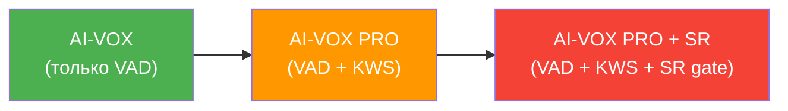

Все три режима используют общий входной буфер (Input signal and Buffer) и систему VAD (Voice Activity Detection). Каждый последующий режим добавляет дополнительный уровень проверки перед разрешением передачи:

- **AI-VOX** — VAD обнаружил голос → сразу передача
- **AI-VOX PRO** — VAD + KWS: стартовая команда (1–3) открывает передачу, команда 4 (disconnect) закрывает. SR не используется.
- **AI-VOX PRO + SR** — то же что AI-VOX PRO, но стартовая команда дополнительно проверяется через SR модель (однократно, как «второй ключ»). SR не работает на поток речи — только на авторизацию.

---

## 1. AI-VOX

**Описание:** Базовый режим голосовой активации. Используется только VAD для определения наличия речи. Как только VAD обнаруживает голос — начинается передача.

### 1.1 Механика кольцевого буфера (КРИТИЧНО)

Входной буфер работает как **кольцевой буфер фиксированной длины**:

- Вход VAD-сети: **128 сэмплов** (8 мс при 16 kHz)
- Рабочий чанк VAD: **256 сэмплов = 16 мс** (VAD анализирует каждый второй блок по 128 — пропуск не влияет на точность, подтверждено тестами)
- Размер буфера: **10 чанков = 160 мс = 2560 сэмплов = 5120 байт**
- Буфер заполняется непрерывно: каждый новый чанк записывается в следующую позицию
- При переполнении: **11-й чанк вытесняет 1-й** (кольцевая перезапись)
- VAD анализирует каждый рабочий чанк (16 мс) независимо (voice / not voice)

**Логика VAD Start (set to 4):**
- VAD считает **последовательные** рабочие чанки с обнаруженным голосом
- Пока нет 4 подряд — **флаг VAD Start не выставляется**, буфер продолжает перезаписываться
- Как только 4 чанка подряд = voice → VAD Start срабатывает
- 4 чанка × 16 мс = **64 мс** задержка принятия решения

**Ключевой момент — привязка Output Start Marker:**

```
Output Start Marker = Current Position − VAD Start Marker (в чанках)
```

Это означает: выдача начинается **не с текущего чанка, а с чанка, где голос реально начался** — на 4 чанка (64 мс) назад в буфере.

**Пример:**

```
Чанк:         1     2     3     4     5     6     7     8     9    10    11    12
Время (мс):   0    16    32    48    64    80    96   112   128   144   160   176
VAD:          —     —     —     V     V     V     V     V     V     V     V     V
                                ↑                       ↑
                          начало голоса            VAD Start
                          (чанк 4, 48 мс)          (чанк 8, 112 мс)
                                |                       |
                       Output Start Marker         VAD принял решение
                                |
                       Выдача начинается отсюда → O4, O5, O6, O7, O8, O9...
```

- Чанки 1–3: шум, не содержат голоса
- Чанки 4–7: голос, но VAD ещё набирает 4 подтверждения подряд
- Чанк 8 (112 мс): VAD Start — 4-й подряд чанк с голосом, решение принято
- Output Start Marker → чанк 4 (48 мс) — начало реального голоса
- Output signal: **O4, O5, O6, O7, O8, O9, O10...** — первые 4 блока (O4–O7) берутся ретроспективно из кольцевого буфера, далее в реальном времени

> **Следствие:** Буфер 10 чанков (160 мс) с запасом вмещает pre-roll для VAD Start Marker = 4 (минимум 4 чанка = 64 мс). Оставшиеся 6 чанков (96 мс) — запас на случай задержек выдачи.

### 1.2 State Diagram

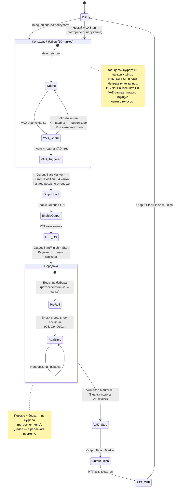

### 1.3 Timing / Signal Flow

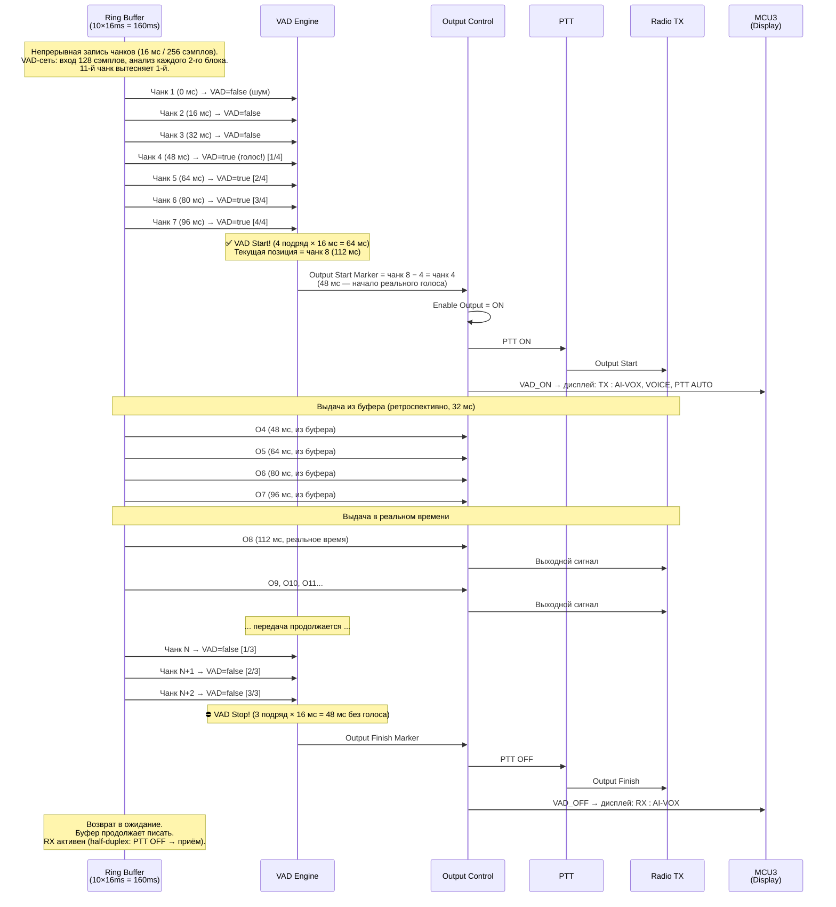

### 1.4 Ключевые параметры AI-VOX

| Параметр | Значение | Описание |
|---|---|---|
| Вход VAD-сети | 128 сэмплов = 8 мс | Нативный размер входа модели |
| Рабочий чанк VAD | 256 сэмплов = 16 мс = 512 байт | VAD анализирует каждый 2-й блок (экономия, без потери точности) |
| Размер кольцевого буфера | 10 чанков = 160 мс = 5120 байт | 11-й вытесняет 1-й |
| VAD Start Marker | set to 4 (конфигурируемый) | 4 чанка подряд VAD=true (64 мс) → голос подтверждён |
| VAD Stop Marker | set to 3 (конфигурируемый) | 3 чанка подряд VAD=false (48 мс) → голос пропал |
| Output Start Marker | Current Position − VAD Start Marker | Начало выдачи = начало реального голоса (на 4 чанка / 64 мс назад) |
| Output Finish Marker | Позиция последнего VAD=true чанка | Конец выдачи |
| Enable Output | ON после VAD Start, OFF после VAD Stop | Разрешение выхода |
| PTT | ON/OFF синхронно с Enable Output | Управление передатчиком |
| Pre-roll | 4 чанка = 64 мс из буфера | Ретроспективная выдача начала фразы |
| Выдача после pre-roll | Реальное время | Блоки передаются по мере поступления |

---

## 2. AI-VOX PRO

> ⚠️ **Новый в v1.2** — заменяет старый «AI-VOX + SR»

**Описание:** Командный режим с голосовым управлением (KWS — Keyword Spotting). После обнаружения голоса через VAD, система накапливает KWS буфер и ожидает голосовую команду. Стартовые команды (1–3) активируют передачу (переход в AI-VOX режим). Команда 4 (disconnect) завершает сессию. **SR в этом режиме не используется** — авторизация только по KWS.

### 2.0 Принцип работы (обзор)

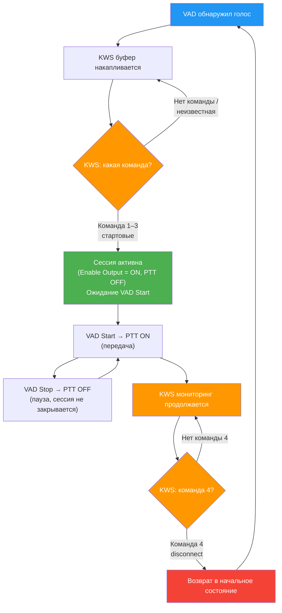

### 2.1 Таблица команд KWS

| ID | Команда | Тип | Действие |
|---|---|---|---|
| 1 | *(стартовая команда 1)* | Start | Переход в AI-VOX режим |
| 2 | *(стартовая команда 2)* | Start | Переход в AI-VOX режим |
| 3 | *(стартовая команда 3)* | Start | Переход в AI-VOX режим |
| 4 | disconnect | Stop | Выход из AI-VOX → возврат в начальное состояние |

> **Примечание:** Конкретные ключевые слова для команд 1–3 определяются конфигурацией KWS модели (Sensory). Команда 4 "disconnect" — фиксированная.

### 2.2 State Diagram

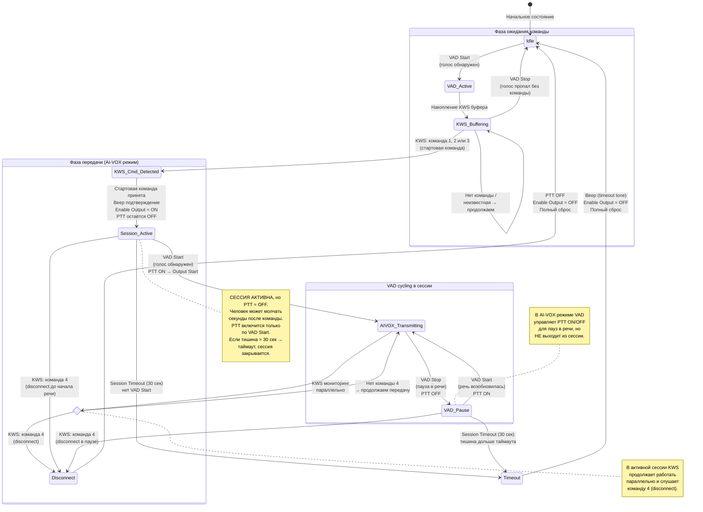

### 2.3 State Diagram (детализация PTT в AI-VOX фазе)

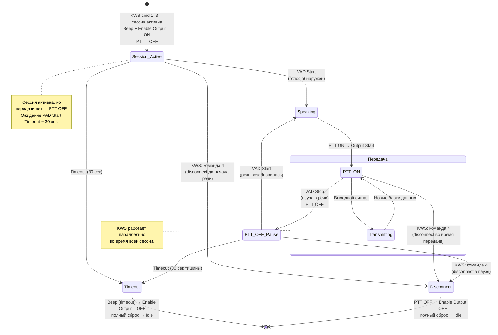

### 2.4 Timing / Signal Flow — Полный цикл (connect → transmit → disconnect)

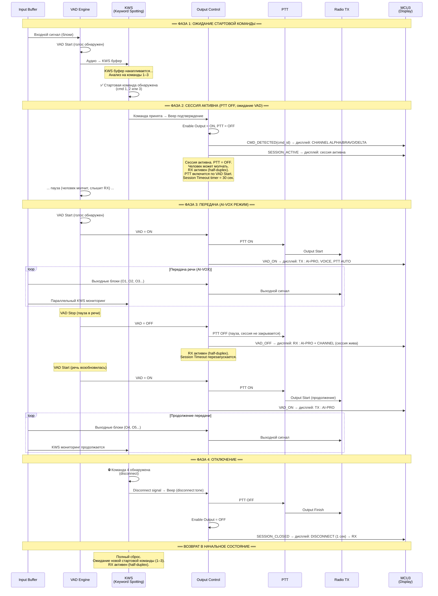

### 2.5 Ключевые параметры AI-VOX PRO

| Параметр | Значение | Описание |
|---|---|---|
| VAD Start Marker | set to 4 (единый, задаётся однократно) | Порог обнаружения начала речи |
| VAD Stop Marker | set to 3 (единый, задаётся однократно) | Порог обнаружения окончания речи |
| KWS команды 1–3 | Start (стартовые) | Инициируют переход в AI-VOX режим |
| KWS команда 4 | disconnect (Stop) | Выход из AI-VOX → полный сброс |
| Session Timeout | 30 сек (конфигурируемый) | Если в активной сессии нет VAD Start дольше таймаута → beep + автозакрытие сессии |
| SR | **Не используется** | — |
| Enable Output | ON после KWS cmd 1–3 | Разрешение выхода по стартовой команде, PTT остаётся OFF |
| PTT в сессии | Управляется VAD | PTT ON по VAD Start, PTT OFF по VAD Stop |
| KWS в сессии | Параллельный мониторинг | Только команда 4 (disconnect) |
| Сессионность | Да | connect (cmd 1–3) / disconnect (cmd 4) / timeout |

---

## 3. AI-VOX PRO + SR

> ⚠️ **Переименован в v1.2** (ранее «AI-VOX PRO» в v1.1)

**Описание:** Командный режим с двухфакторной авторизацией (KWS + SR). Работает аналогично AI-VOX PRO (режим 2), но стартовая команда дополнительно проверяется через SR модель — верификация говорящего как «второй ключ». SR работает **только один раз** на буфер стартовой команды — не на весь речевой поток (экономия ресурсов). После авторизации SR выключается, система переходит в AI-VOX режим с параллельным KWS мониторингом.

### 3.0 Принцип работы (обзор)

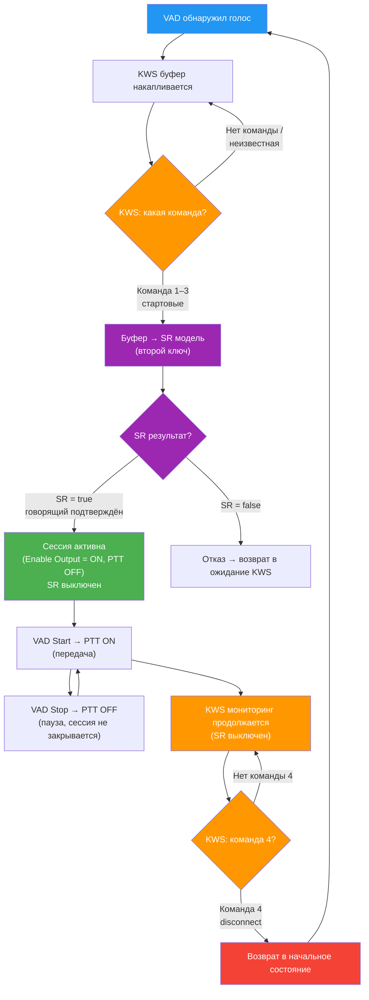

### 3.1 Отличие от AI-VOX PRO (режим 2)

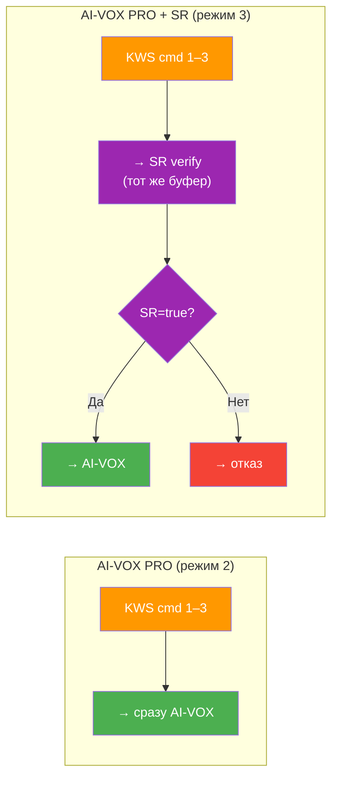

Единственное отличие: между детекцией стартовой команды и переходом в AI-VOX добавляется однократная SR верификация. Всё остальное (KWS мониторинг, disconnect, VAD cycling) — идентично режиму 2.

### 3.2 State Diagram (основной)

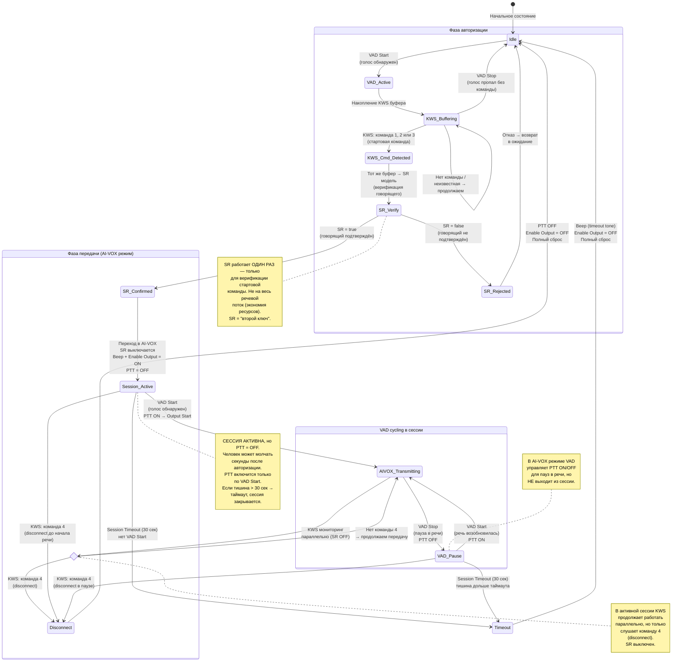

### 3.3 State Diagram (детализация PTT в AI-VOX фазе)

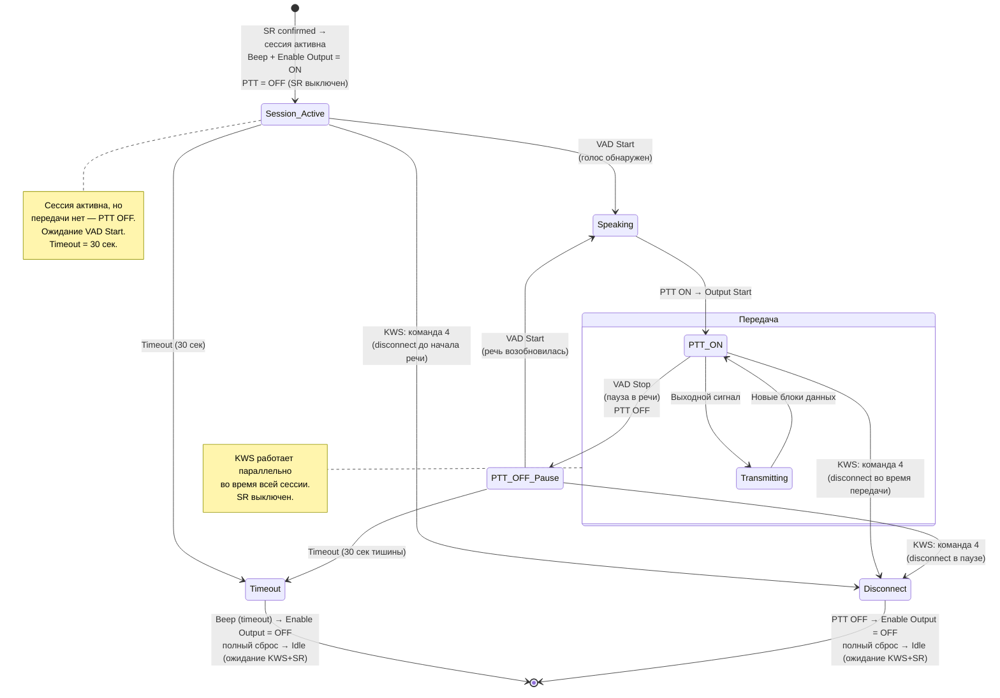

### 3.4 Timing / Signal Flow — Полный цикл (connect → transmit → disconnect)

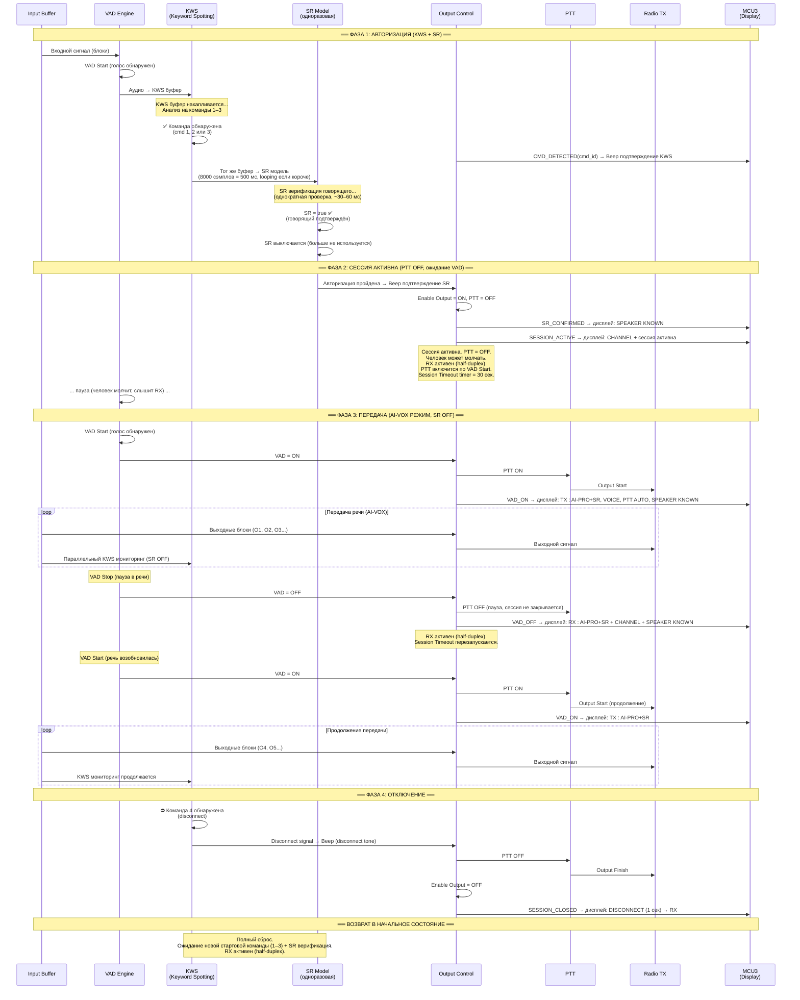

### 3.5 Timing / Signal Flow — Сценарий отказа SR

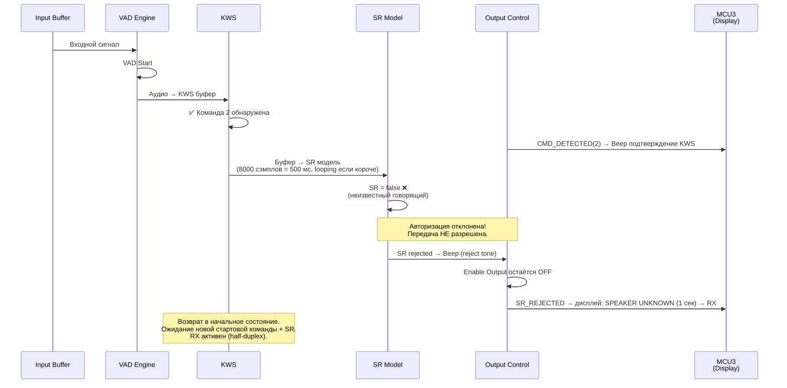

### 3.6 Ключевые параметры AI-VOX PRO + SR

| Параметр | Значение | Описание |
|---|---|---|
| VAD Start Marker | set to 4 (единый, задаётся однократно) | Порог обнаружения начала речи |
| VAD Stop Marker | set to 3 (единый, задаётся однократно) | Порог обнаружения окончания речи |
| KWS команды 1–3 | Start (стартовые) | Инициируют авторизацию (KWS → SR) |
| KWS команда 4 | disconnect (Stop) | Выход из AI-VOX → полный сброс |
| Session Timeout | 30 сек (конфигурируемый) | Если в активной сессии нет VAD Start дольше таймаута → beep + автозакрытие сессии |
| SR модель | Однократная | Работает ОДИН РАЗ на буфер стартовой команды. Не на речевой поток. |
| SR буфер | = KWS буфер | Тот же буфер, что накоплен для KWS, передаётся в SR |
| SR результат | true / false | true → AI-VOX, false → отказ → начальное состояние |
| SR в AI-VOX фазе | **Выключен** | Экономия ресурсов, SR не нужен после авторизации |
| Enable Output | ON после SR=true | Разрешение выхода только после двухфакторной проверки, PTT остаётся OFF |
| PTT в сессии | Управляется VAD | PTT ON по VAD Start, PTT OFF по VAD Stop |
| KWS в сессии | Параллельный мониторинг | Только команда 4 (disconnect), SR выключен |

### 3.7 Логика переходов (сводка)

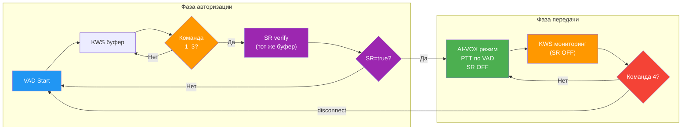

---

## Сравнительная таблица режимов

```mermaid
graph TD
    subgraph "AI-VOX"
        A1[VAD] --> A2[Output + PTT]
    end

    subgraph "AI-VOX PRO"
        B1[VAD] --> B2[KWS буфер]
        B2 --> B3["KWS cmd 1–3"]
        B3 --> B4["AI-VOX режим<br/>+ KWS мониторинг"]
        B4 --> B5["KWS cmd 4<br/>(disconnect)"]
        B5 --> B1
    end

    subgraph "AI-VOX PRO + SR"
        C1[VAD] --> C2[KWS буфер]
        C2 --> C3["KWS cmd 1–3"]
        C3 --> C4["SR verify<br/>(однократно)"]
        C4 --> C5["AI-VOX режим<br/>+ KWS мониторинг<br/>SR OFF"]
        C5 --> C6["KWS cmd 4<br/>(disconnect)"]
        C6 --> C1
    end

    style A1 fill:#4CAF50,color:#fff
    style A2 fill:#4CAF50,color:#fff
    style B1 fill:#FF9800,color:#fff
    style B2 fill:#FF9800,color:#fff
    style B3 fill:#FF9800,color:#fff
    style B4 fill:#4CAF50,color:#fff
    style B5 fill:#f44336,color:#fff
    style C1 fill:#f44336,color:#fff
    style C2 fill:#f44336,color:#fff
    style C3 fill:#f44336,color:#fff
    style C4 fill:#9C27B0,color:#fff
    style C5 fill:#4CAF50,color:#fff
    style C6 fill:#f44336,color:#fff
```

| Характеристика | AI-VOX | AI-VOX PRO | AI-VOX PRO + SR |
|---|---|---|---|
| VAD | ✅ | ✅ | ✅ |
| KWS (Keyword Spotting) | ❌ | ✅ (команды 1–4) | ✅ (команды 1–4) |
| Speaker Recognition | ❌ | ❌ | ✅ (однократный, «второй ключ») |
| Авторизация | Нет | KWS cmd 1–3 | KWS cmd 1–3 → SR (один раз) |
| Деавторизация | — | KWS cmd 4 (disconnect) | KWS cmd 4 (disconnect) |
| VAD Start Marker | 4 | 4 | 4 |
| VAD Stop Marker | 3 | 3 | 3 |
| SR активен во время TX | — | — | ❌ (выключен после авторизации) |
| KWS активен во время TX | — | ✅ (мониторинг cmd 4) | ✅ (мониторинг cmd 4) |
| Задержка до PTT | Минимальная | Средняя (KWS detect) | Средняя+ (KWS detect + SR verify) |
| Уровень защиты | Базовый | Средний (только KWS) | Максимальный (двухфакторный) |
| Ложные срабатывания | Возможны | Снижены | Минимальны |
| Сессионность | Нет | Да (connect / disconnect / timeout) | Да (connect / disconnect / timeout) |
| Нагрузка на ресурсы | Минимальная | Средняя (VAD + KWS) | Средняя (SR только при авторизации) |

---

## Параметры маркеров и буферов

### Входной буфер (Input Signal and Buffer)

Все режимы используют **кольцевой буфер** с рабочими чанками по 256 сэмплов (16 мс при 16 kHz).

**AI-VOX — кольцевой буфер MCU1:**
- Рабочий чанк: 256 сэмплов = 16 мс (VAD-сеть: вход 128 сэмплов, анализ каждого 2-го блока)
- Размер: 10 чанков × 16 мс = 160 мс (2560 сэмплов, 5120 байт)
- Тип: кольцевой (11-й чанк вытесняет 1-й)
- Назначение: хранение pre-roll (начало фразы до момента принятия решения VAD)
- При VAD Start: выдача начинается с позиции `Current Position − VAD Start Marker` чанков (ретроспективно из буфера)
- Минимальный размер буфера: ≥ VAD Start Marker чанков (4 × 16 мс = 64 мс)

**AI-VOX PRO / AI-VOX PRO + SR — KWS буфер на MCU2 (Sensory):**
- MCU1 передаёт аудио по UART **только при VAD=ON** (+ pre-roll 4 чанка). При VAD=OFF аудио не передаётся — экономия UART bandwidth
- MCU2 пишет всё полученное в Sensory (перепаковка 256→240 сэмплов)
- VAD=OFF → MCU1 прекращает передачу, шлёт `EVT_VAD(flag=0)`. MCU2 отдаёт Sensory остаток на анализ
- Trigger не найден → Sensory restart, буфер сброшен, ожидание следующего VAD=ON
- Trigger найден → Session Active
- Sensory brick: **240 сэмплов = 15 мс** — порция на один вызов `SensoryProcessData()`
- Внутренний аудио-буфер Sensory: **630 мс = 10080 сэмплов = ~20 кБ**
- Backoff (ретроспективный просмотр): **270 мс** (для endpoint detection)
- InputBuffer MCU2: **32000 сэмплов = 2 секунды** (кольцевой, float)
- MCU2 перепаковывает VAD-чанки MCU1 (256 сэмплов / 16 мс) в Sensory brick'и (240 сэмплов / 15 мс) — это **не 1:1**, требуется промежуточный буфер
- В режиме PRO + SR: тот же Sensory буфер (с endpoint detection) передаётся на SR модель

### Параметры VAD на MCU1 (ЕДИНЫЕ для всех режимов)

> **Архитектурное решение:** VAD параметры задаются на MCU1 **однократно** при инициализации и **не меняются** при переключении режимов на MCU2. MCU1 не знает о режимах AI-VOX / PRO / PRO+SR — это логика MCU2. Конкретные значения подбираются по результатам тестов и фиксируются в конфигурации.

| Параметр | Значение | Примечание |
|----------|----------|------------|
| VAD Start Marker | 4 (подбирается тестами) | Единый для всех режимов |
| VAD Stop Marker | 3 (подбирается тестами) | Единый для всех режимов |
| VAD chunk | 256 сэмплов = 16 мс | Фиксированный, привязан к VAD-сети |
| Pre-roll буфер | 10 чанков = 160 мс | Кольцевой, MCU1 |

### Маркеры (Markers)

| Маркер | Описание | AI-VOX | AI-VOX PRO | AI-VOX PRO + SR |
|---|---|---|---|---|
| VAD Start Marker | Начало обнаруженной речи | ✅ | ✅ | ✅ |
| VAD Stop Marker | Конец обнаруженной речи | ✅ | ✅ (в AI-VOX фазе управляет PTT) | ✅ (в AI-VOX фазе управляет PTT) |
| Output Start Marker | Начало выходного блока | Привязан к VAD Start | Привязан к KWS cmd 1–3 | Привязан к SR=true |
| Output Finish Marker | Конец выходного блока | Привязан к VAD Stop | Привязан к KWS cmd 4 | Привязан к KWS cmd 4 |
| KWS Command Marker | Обнаруженная команда | — | cmd 1–3 (start), cmd 4 (disconnect) | cmd 1–3 (start), cmd 4 (disconnect) |
| SR Start Marker | Начало SR обработки | — | — | Позиция KWS буфера (однократно) |

### Буфер KWS (AI-VOX PRO и AI-VOX PRO + SR)

В режимах AI-VOX PRO и AI-VOX PRO + SR буфер используется следующим образом:

**AI-VOX PRO:**
1. **Этап KWS:** Буфер накапливается после VAD Start. KWS анализирует поток на наличие команд 1–3.
2. **Результат:** Команда обнаружена → сразу переход в AI-VOX режим.

**AI-VOX PRO + SR (дополнительный этап):**
1. **Этап KWS:** Буфер накапливается после VAD Start. KWS анализирует поток на наличие команд 1–3.
2. **Этап SR:** При обнаружении стартовой команды **тот же буфер** (без повторного накопления) передаётся в SR модель для верификации говорящего.
3. **Результат:** SR=true → авторизация, SR выключается. SR=false → сброс, повторное ожидание.

> **Ключевое ограничение по ресурсам:** SR не работает на весь речевой поток — только однократно на буфер стартовой команды. Это принципиальное архитектурное решение для экономии вычислительных ресурсов MCU2.

### Выходной сигнал (Output Signal)

- **AI-VOX:** выходные блоки O1, O2, O3... передаются при VAD Start → VAD Stop
- **AI-VOX PRO:** передача начинается после KWS cmd 1–3, прекращается по KWS cmd 4
- **AI-VOX PRO + SR:** передача начинается после KWS cmd 1–3 + SR=true, прекращается по KWS cmd 4
- Во всех режимах: между передачами (PTT OFF → PTT ON) выходной сигнал отсутствует

---

## Changelog

| Версия | Дата | Изменения |
|---|---|---|
| 1.0 | 2025-02-07 | Первоначальная конвертация из PDF. Три режима: AI-VOX, AI-VOX+SR, AI-VOX PRO (wake word) |
| 1.1 | 2025-02-07 | Переработан режим 3: новая логика KWS→SR(однократный)→AI-VOX с командами 1–4 |
| 1.2 | 2025-02-07 | Исправлена структура режимов: режим 2 = AI-VOX PRO (VAD+KWS, без SR), режим 3 = AI-VOX PRO + SR (KWS + однократная SR авторизация). SR работает только на авторизацию, не на речевой поток. |
| 1.3 | 2025-02-07 | Унификация версии в рамках документ-пакета. Уточнение: «MCU» → «MCU2» в контексте ресурсов. Кросс-ссылки синхронизированы с Architecture v1.3.6 и UART Protocol v1.3.6. |
| 1.3.2 | 2025-02-08 | Уточнены параметры VAD и KWS буферов по данным из Keln кода. VAD рабочий чанк = 256 сэмплов (16 мс). KWS Sensory: brick = 240 (15 мс), буфер = 630 мс. Добавлена механика кольцевого буфера для AI-VOX. |
| 1.3.3 | 2025-02-08 | **Критичное исправление:** PTT в AI-VOX PRO и PRO+SR. После KWS cmd (или SR=true) сессия активируется (Enable Output=ON), но PTT остаётся OFF. PTT ON — только по VAD Start. Добавлено состояние Session_Active во все state/timing диаграммы. Disconnect возможен из любого состояния сессии (Session_Active, PTT ON, VAD Pause). |
| 1.3.6 | 2026-02-12 | **MCU2→MCU3 status messages:** Добавлен participant MCU3 (Display) во все sequence diagrams. Добавлены сообщения: CMD_DETECTED, SESSION_ACTIVE, SESSION_CLOSED, SR_CONFIRMED, SR_REJECTED, VAD_ON, VAD_OFF — с описанием реакции дисплея. **Naming:** Исправлены неканонические наименования («AI-VOX KWS» → «AI-VOX PRO», «AI-VOX + SR» оставлен только в историческом контексте). **SR:** Encoder input = 8000 сэмплов (500 мс), looping если короче. **Half-duplex:** Добавлен RX path (PTT OFF → приём активен) во все sequence diagrams. Cross-references обновлены на v1.3.6. |

---

> **Примечания к документу:**
> - State diagrams являются логической интерпретацией требований к системе
> - Режим 1 (AI-VOX) не изменён с v1.0
> - Режим 2 (AI-VOX PRO) — новый с v1.2, заменяет старый «AI-VOX + SR»
> - Режим 3 (AI-VOX PRO + SR) — переименован и уточнён с v1.1
> - Связанные документы: `01_2026_NC_architecture_v1.3.6.md`, `UART_Protocol_Spec_v1.3.6.md`, `NeuroComm_UI_Spec_v1.0.md`
> - Для просмотра Mermaid диаграмм используйте редактор с поддержкой Mermaid (VS Code, GitHub, и др.)
